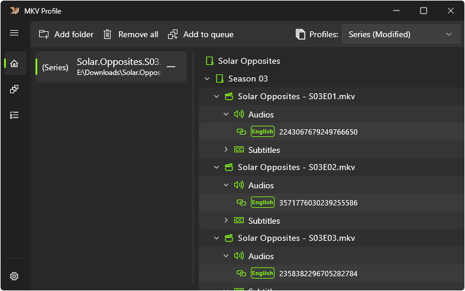
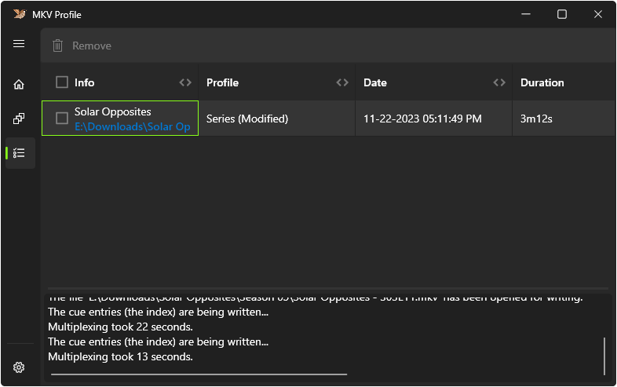
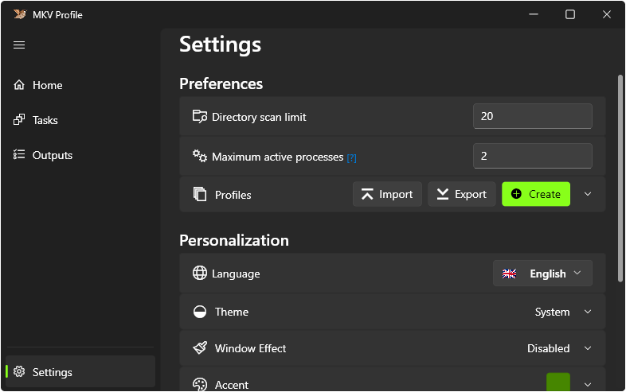

# MKV Profile

Automatically manage and mux series or movie files to the common conventions used by media players and media servers. The GUI is intentionally made simple and is designed for least user interactions by implementing per profile configuration to manage files and generate a command to be used on muxing process.

## Preview

More Preview

## Download
 

## Installation
- **Portable (ZIP)**
1. Head to the downloaded zip file
1. Extract contents
1. Run mkv_profile.exe to launch app

- **Setup (EXE)**
1. Head to the downloaded executable setup file
1. Run setup as administrator
1. Follow the rest of the installation steps within the setup window
1. Check **Launch MKV Profile** or Run the shortcut created after the installation to launch app

- **Installer (MSIX)**
    - Note: Requires Certificate Installation (first time only or if previously removed)
1. Head to the downloaded msix file
1. Right click and select properties
1. From the properties dialog, select Digital Signatures tab
1. Select the Signature from the list and press Details
1. Press View Certificate
    1. To view Certificate details, select Details tab
    1. To install certificate, head to General tab and press Install Certificate
1. After the certificate is installed, you can run the msix installer
1. Check **Launch when ready** in the installer or Run the shortcut created after the installation to launch app

## Available Profile Configurations
- Show (Movie / Series) Title Formats
    - ***Example:*** `%show_title%% (year)%`

    |Data|Variable|
    |:-|:-|
    |Duration|`%duration%`|
    |Encoding|`%encoding%`|
    |Frame Rate|`%frame_rate%`|
    |Height|`%height%`|
    |Size|`%size%`|
    |Title|`%show_title%`|
    |Width|`%width%`|
    |Year|`%year%`|
- Video Title Formats
    - ***Example:*** `%show_title%% - Sseason_number%%Eepisode_number%% - episode_title%`

    |Data|Variable|
    |:-|:-|
    |Language|`%language%`|
    |Duration|`%duration%`|
    |Encoding|`%encoding%`|
    |Episode (For Series)|`%episode_number%`|
    |Format|`%format%`|
    |Frame Rate|`%frame_rate%`|
    |Height|`%height%`|
    |Season (For Series)|`%season_number%`|
    |Size|`%size%`|
    |Title|`%show_title%`|
    |Width|`%width%`|
    |Year|`%year%`|
- Audio Title Formats
    |Data|Variable|
    |:-|:-|
    |Language|`%language%`|
    |Format|`%format%`|
    |Bit Rate|`%bit_rate%`|
    |Channels|`%channels%`|
    |Sampling Rate|`%sampling_rate%`|
    |Default|`%default%`|
    |Original Language|`%original_language%`|
    |Forced|`%forced%`|
    |Commentary|`%commentary%`|
    |Hearing Impaired|`%hearing_impaired%`|
    |Visual Impaired|`%visual_impaired%`|
    |Text Description|`%text_description%`|
- Subtitle Title Formats
    - ***Example:*** `%language%% (hearing_impaired)%% (forced)%`

    |Data|Variable|
    |:-|:-|
    |Language|`%language%`|
    |Format|`%format%`|
    |Default|`%default%`|
    |Original Language|`%original_language%`|
    |Forced|`%forced%`|
    |Commentary|`%commentary%`|
    |Hearing Impaired|`%hearing_impaired%`|
    |Visual Impaired|`%visual_impaired%`|
    |Text Description|`%text_description%`|
- Specify the Languages to be Included
- Specifying the Subtitle Default Flag
    - Specify which Language can be set to Default
    - Specify the Order Fallbacks of Flags that will be set as default
        - NOTE: If Default is used in the Flag Order, It will set the Default Flag to a subtitle track that doesn't have any of the available track flags set to true.
- Modifiers
    - User can specify text or regex pattern that will be replaced by another specified text or an empty text.
    - Recommended to put longer text and Regex that matches long text at the start of the list and shortest text at the end of the list
- Specify Extra options (mkvmerge commands) for tracks

## Title Scanning
**Note:** Characters can be conditional if the variable used has no data\
e.g. **Video Title Format** is set to `%show_title%% - Sseason_number%%Eepisode_number%% - episode_title%`\
If episode_title has data, then it will return `Tom Clancy's Jack Ryan - S01E01 - Pilot`\
otherwise if empty, will return  `Tom Clancy's Jack Ryan - S01E01`
- **Show:** Uses folder name (if Use Folder Name is set to TRUE in Profile Configuration) or the file name of first video available to be used as a source title alongside with the modifiers. Variables specified in the *Show* title format will be replaced with the corresponding data.
- **Video:** Uses the video file's name as the source title to be used alongside with the modifiers. Variables specified in the *Video* title format will be replaced with the corresponding data.
- **Audio:** Variables specified in the *Audio* title format will be replaced with the corresponding data.
- **Subtitle:** Variables specified in the *Subtitle* title format will be replaced with the corresponding data.

## Language Scanning
- **Embedded:** Uses language code tag, if the tag is *Undetermined* it will scan the track title to match a language.
- **Added:** Scans the file title to match a language.

## Available Track Options (Video/Audio/Subtitle)
- Title
- Language
- **Flags** [Enabled, Default, Original Language, Forced, Commentary, Hearing Impaired, Visual Impaired, Text Description]
- Extra Options field for [mkvmerge commands](https://mkvtoolnix.download/doc/mkvmerge.html) (Separated by space)
    - You can use the variable %id% to access the track id in the user specified extra options
    - e.g. `--default-duration %id%:23.976fps --no-track-tags --no-global-tags`
## Available Video Options
- No Chapters
- No Attachments
## Available Attachment Options (Chapters/Fonts/Images)
- Extra Options field for [mkvmerge commands](https://mkvtoolnix.download/doc/mkvmerge.html) (Separated by space)
    - NOTE: This option is only available for added (non-embedded) attachments.

## Detection of Movies or Series
This app assumes folders with single video file as movie, for folders that contains multiple videos — will be detected as series. If detected as series, file names will be used to assume and detect any indication the Season and Episode numbers.

## Supported Formats
**Video:** [avi, mov, mp4, mpeg, mpg, m4v, mkv]

**Audio:** [aac, flac, m4a, mp3, ogg, opus, wav]

**Subtitle:** [srt, ass, ssa]

**Chapter:** [ogm, txt, xml]

**Font:** [ttf, otf]

**Image:** [jpg, jpeg, png]

## Third Party Requirements
This app rely on the third party tools [MediaInfo](https://mediaarea.net/en/MediaInfo) and [MKVMerge](https://mkvtoolnix.download/doc/mkvmerge.html) thus required for this app to work. These tools are already included in the installers. However, you can download it their websites to use other version:
- [MediaInfo](https://mediaarea.net/en/MediaInfo/Download/Windows)
- [MKVMerge](https://mkvtoolnix.download/downloads.html#windows)

# Frequently Asked Questions

## Why do I have to install the certificate before installing?
This project uses self signed certificate because trusted signed certificates from services comes with a cost which isn't reasonable for a FOSS project.
To see how the certificate was created. [Read more here](https://docs.flutter.dev/platform-integration/windows/building#msix-packaging)

## Third party tools path is default but its not working?
The saved path was probably from an old installation, to reset it or entirely clear old app data:
- **Reset Tool Path**
    - Head to Settings
    - On the Miscellaneous section find and expand Tools section
    - Click on the reset button to use the default path.
- **Clear Old App Data**
    - Reminder: Export the profiles you've created before procedding.
    - Open File Explorer
    - Head to C:\Users\\`<Username>`\AppData\Roaming **or** C:\Users\\`<Username>`\AppData\Local\Packages
    - Find the folder that contains the word `harlanx` or the folder inside it named `MKV Profile` then delete it
    - Reopen the app
    - The path will be set to the default path of the third party binaries that comes with the app
## Updated the app, now its showing white screen?
- **Manually Migrate Old App Settings to New**
    - Head to C:\Users\\`<Username>`\AppData\Roaming **or** C:\Users\\`<Username>`\AppData\Local\Packages
    - Find the folder that contains the word `harlanx`
    - Open the folder `MKV Profile` and create a backup copy of `shared_preferences.json`
    - Now delete the entire `MKV Profile` folder and reopen the app
    - Now you can recreate the profiles by manually copying contents from shared_preferences.json\
    Note: Use a json formatter to find your required data easily
- **Clear Old App Data and Start Over**
    - Open File Explorer
    - Head to C:\Users\\`<Username>`\AppData\Roaming **or** C:\Users\\`<Username>`\AppData\Local\Packages
    - Find the folder that contains the word `harlanx` or the folder inside it named `MKV Profile` then delete it
    - Reopen the app

## Specified custom path of the third party tools but it doesn't work?
This app have a test that makes sure if third party tools work before doing any actions.
If you opt out to use the version of third party tools that comes with this app, or you have downloaded a newer version but it doesn't work. Make sure that:
- The directory and the file you've specified still exists
- You have the correct version of the file
    - **MediaInfo File Required**
        - Windows
        - 64 bit
        - DLL file extension
        - You can [Download](https://mediaarea.net/en/MediaInfo/Download/Windows) it here and choose the option without installer (7z or zip)
    - **MKVMerge File Required**
        - Windows
        - 64 bit
        - EXE file extension
        - You can [Download](https://mkvtoolnix.download/downloads.html#windows) it here and choose portable if you only need to get the mkvmerge file or installer (it's a set of tools) if you need those other tools that comes with it.

## How can I contribute to the project?
Any contributions such as reporting bugs will be a great help in making better experience. Anyone interested in collaborating with this project are welcome to contribute.
